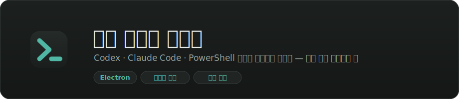
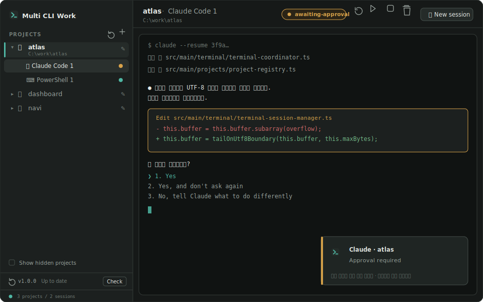
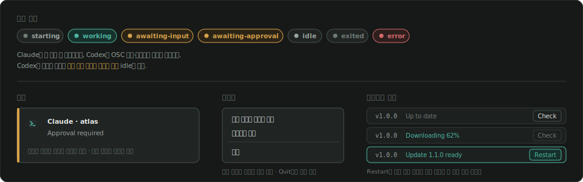
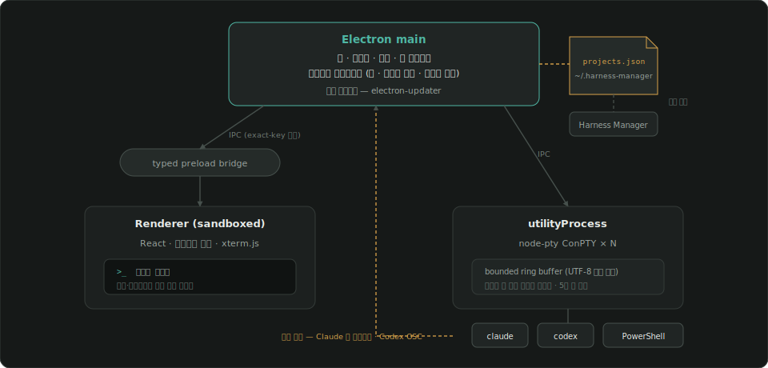

<p align="center">
  
</p>

<p align="center">
  
  
  
  
  
  
</p>

**멀티 터미널 작업기**는 여러 개의 **CLI 에이전트 세션을 작업 폴더 단위로 묶어** 한 창에서 굴리는 **로컬 전용 Windows 데스크톱 앱**(Electron)이다. **Codex · Claude Code · PowerShell** 이 기본으로 들어 있고, 그 밖의 CLI는 `agents.json`에 적어 넣으면 같은 자격으로 붙는다.

- 왼쪽 트리에 **열어둔 폴더**, 그 아래 **세션들**. 오른쪽엔 지금 보고 있는 터미널 하나.
- 좌측 상단 로고를 누르면 전체 세션을 한눈에 보는 **홈 대시보드**로, 폴더를 누르면 그 폴더의 세션·git 상태·메모를 모아보는 **상세 페이지**로 이동한다. 세션을 직접 누르면 바로 터미널이 뜬다.
- 각 세션이 **무슨 상태인지**(작업 중 · 입력 대기 · 종료) 한눈에 보이고, 다른 세션이 나를 기다리기 시작하면 **Windows 알림**이 뜬다.
- 창을 닫아도 **트레이에 상주**하며 세션은 계속 돈다. 앱을 재시작하면 폴더·탭·스크롤백이 복원된다.
- 폴더 목록은 이 앱만의 것(`~/.multi-cli-work/projects.json`)이다. 열어둔 폴더만 남고, 저절로 늘어나지 않는다.

터미널·창·스크롤백은 이 앱 안에만 있고, 네트워크 포트를 열지 않는다(렌더러↔main은 Electron IPC). 업데이트 확인 외에 외부로 나가는 통신은 없다.

## 미리보기

<p align="center"></p>

<p align="center"><em>왼쪽에 프로젝트와 그 아래 세션들, 오른쪽에 지금 보고 있는 터미널 하나. 가려진 세션이 승인을 기다리기 시작하면 알림이 뜬다.</em></p>

<p align="center"></p>

<p align="center"><em>세션 상태 · 알림 규칙 · 트레이 메뉴 · 업데이트 배지의 상태 전이.</em></p>

## 빠른 시작

1. [Releases](https://github.com/rafaam11/multi-cli-work/releases)에서 **`Multi-CLI-Work-Setup-x.y.z.exe`** 를 내려받아 실행한다.
2. 서명되지 않은 빌드라 Windows SmartScreen 경고가 뜬다 — **추가 정보 → 실행**으로 진행한다.
3. 설치는 **사용자 단위**라 관리자 권한이 필요 없다. 바탕화면/시작 메뉴의 **Multi CLI Work**(앱 내부 표시명은 "멀티 터미널 작업기")로 실행한다.

**Node.js 설치는 필요 없다**(Electron에 런타임이 내장됨). 다만 세션을 띄우려면 그 CLI가 있어야 한다 — PowerShell은 Windows 기본, `claude`·`codex`는 `PATH`에 있으면 자동 인식하고 없으면 해당 메뉴가 비활성된다. 다른 CLI를 붙이려면 아래 **에이전트 추가**를 본다.

## 업데이트 (자동)

이 저장소는 **public**이라 앱이 새 버전을 **자동으로** 받는다. 실행 시(또는 트레이 → **업데이트 확인**) GitHub 릴리스를 조회해 새 버전이 있으면 **배경에서 차등 다운로드**(blockmap delta)하고, 완료되면 사이드바 배지가 **`재시작`** 으로 바뀐다. 누르면 **돌고 있는 세션을 먼저 정리한 뒤** 인스톨러 창 없이 무음 설치하고 앱이 자동 재실행된다(그냥 종료해도 다음 실행에 적용됨). 자동 확인이 실패하면 같은 자리에 **`릴리스`** 링크가 떠 수동 설치로 대체할 수 있다.

> **v1.0.0은 1회 수동 설치**가 필요하다 — 갈아끼울 기존 설치본이 없기 때문. 이후부터는 위 절차로 자동 갱신된다.

## 주요 기능

- **홈 대시보드** — 좌측 상단 로고 클릭 시 진입. 전체 세션을 상태 급한 순으로 모아보는 모니터, CLI·앱 업데이트 상태, 최근 활동 폴더로 바로 세션을 여는 빠른 실행, 세션 상태 전이 이력을 보여주는 최근 활동 피드, 버전·릴리스 노트·GitHub 저장소 바로가기를 한 화면에 모은다.
- **프로젝트 상세 페이지** — 세션을 직접 누르지 않고 폴더를 클릭하면 진입. 그 폴더의 세션 카드 목록(없으면 세션 시작 버튼), 탐색기·VS Code·GitHub 바로가기, 진입 시 조회되는 git 브랜치·변경 파일 수(수동 새로고침 가능), 자동 저장되는 메모와 체크리스트를 모아 보여준다.
- **폴더 트리** — 폴더 하나에 세션 여러 개를 중첩해 붙인다. **＋** 로 작업할 폴더를 열면 목록에 남고, 앱을 껐다 켜도 그대로다. 자동 발견은 하지 않는다 — **내가 연 폴더만** 보인다.
- **폴더 우클릭 메뉴** — **파일 탐색기에서 열기** · **VS Code로 열기**(`code`) · **GitHub에서 열기**(`origin` 리모트를 브라우저로) · **이름 변경** · **목록에서 제거**. 제거는 UI 목록에서만 빼는 것이고 **디스크의 폴더는 건드리지 않는다**(세션이 남아 있으면 먼저 확인한다).
- **세션 이름 = 하는 일** — Claude는 자기가 붙인 세션 제목(`ai-title`)을, Codex는 첫 프롬프트를 트랜스크립트에서 읽어 세션 이름으로 쓴다. 작업이 바뀌면 이름도 따라 바뀐다. 세션을 **우클릭 → 이름 변경** 하면 직접 붙인 이름이 우선하고, **제공자 제목 사용** 으로 되돌린다.
- **에이전트는 데이터다** — PowerShell · Claude Code · Codex는 코드에 박힌 특별한 존재가 아니라 **빌트인 정의**일 뿐이다. `~/.multi-cli-work/agents.json`에 같은 형식으로 적으면 Gemini CLI든 무엇이든 런처에 나란히 선다. 헤더의 🔧 **도구 → 에이전트 추가**를 누르면 예시가 담긴 파일이 편집기로 열리고, 저장하고 앱으로 돌아오면 목록이 갱신된다. 자세한 건 아래 [에이전트 추가](#에이전트-추가).
- **세션 상태 7종** — `starting` · `working` · `awaiting-input` · `awaiting-approval` · `idle` · `exited` · `error`. 각 세션 행이 **상태 색으로 물든다**(작업 중=teal, 입력 대기=violet, 대기=green, 종료=회색, 오류=red). 무엇으로 판정하는지는 에이전트가 고르는 **상태 어댑터**가 정한다 — Claude는 앱 전용 **훅 오버레이**(`--settings`), Codex는 **OSC 9 알림**, PowerShell은 프로세스 신호뿐이다. 다만 아래 권한 플래그를 항상 붙이므로 `awaiting-approval`은 실질적으로 뜨지 않는다.
- **권한 프롬프트 없이 실행** — Claude는 `--dangerously-skip-permissions`, Codex는 `--dangerously-bypass-approvals-and-sandbox` 로 항상 실행한다. 승인 대기로 멈추지 않는 대신 **에이전트가 확인 없이 파일을 고치고 명령을 돌린다** — 신뢰하는 저장소에서만 쓸 것.
- **알림은 놓치지 않게** — **화면에 없는** 세션이 입력 대기나 승인 대기에 들어가면 Windows 알림과 작업표시줄 깜빡임이 함께 켜지고, 창 제목 앞에 표시가 남는다. 같은 상태로 계속 머물면 다시 울리지 않으며, 해당 세션을 열거나 작업이 재개되면 표시가 해제된다.
- **읽지 않음 배지** — 알림과 같은 판정을 사이드바에도 그린다. 화면 밖에서 응답을 기다리기 시작한 세션 행에 점 배지(입력 대기=violet, 승인 대기=amber)가 붙고, 접힌 폴더 행에는 하위 세션 중 가장 급한 상태가 올라온다. 작업표시줄 아이콘에는 오버레이 점, 트레이 툴팁에는 대기 세션 수가 함께 표시된다.
- **빠른 열기 (Ctrl+P)** — 세션·폴더·명령(새 세션 · 홈 대시보드 · 에이전트 추가 · 업데이트 확인)을 한 팔레트에서 퍼지 검색으로 찾아 Enter 한 번에 이동한다. 터미널에 포커스가 있어도 단축키가 먹는다.
- **파일 드래그&드롭** — 탐색기에서 파일·이미지를 터미널에 끌어다 놓으면 따옴표 처리된 절대 경로가 입력줄에 붙는다. 스크린샷을 에이전트에게 보여줄 때 경로를 타이핑할 필요가 없다.
- **트레이 상주 · 세션 보존** — 창을 닫으면 트레이로 숨고 PTY는 살아 있다. **종료**는 "돌고 있는 세션을 끄겠냐"고 확인한 뒤에만 종료한다. 재시작하면 폴더·탭·**바운드 스크롤백**이 복원되고, AI 세션은 눈에 보이는 **재개**를 눌러야 재개된다(`claude --resume` / `codex resume`).
- **CLI 업데이트** — 헤더의 🔧 **도구** 에서 **Claude Code 업데이트** / **Codex 업데이트**. 홈 디렉토리에서 도는 **폴더에 속하지 않는 터미널**이 열려 `claude update` / `codex update` 출력을 그대로 보여준다. 폴더를 하나도 안 열었어도 쓸 수 있다.
- **레지스트리 자가 복구** — 목록 파일이 깨지면 읽기 전용으로 내려앉고 경고 배너에 **복구** 버튼이 뜬다. 검증된 `.bak`으로 되돌린다.
- **자동 업데이트** — 위 참조.

## 사용법

**폴더 열기** — 사이드바의 **＋** 로 작업할 폴더를 연다. 한 번 연 폴더는 앱을 재시작해도 목록에 남는다. 더 안 쓰면 우클릭 → **목록에서 제거**.

**상세 페이지 · 세션 만들기** — 폴더를 클릭하면(세션을 직접 클릭하지 않는 한) 상세 페이지로 이동한다. 세션이 없으면 **PowerShell · Claude Code · Codex** 시작 버튼이, 있으면 세션 카드 목록이 뜬다. 헤더의 런처 버튼은 세션 유무와 상관없이 항상 떠 있고, 세션이 하나라도 생기면 그 자리가 **＋ 새 세션** 드롭다운으로 바뀐다. 세션은 그 폴더를 작업 디렉토리로 열린다. 설치되지 않은 CLI는 비활성으로 표시된다.

**홈으로 돌아가기** — 좌측 상단 로고를 누르면 현재 선택을 건드리지 않고 홈 대시보드로 이동한다. 세션 모니터·빠른 실행·최근 활동 피드 어디서든 클릭 한 번으로 해당 세션으로 돌아갈 수 있다.

**세션 다루기** — 헤더의 **■ 중지** 는 프로세스만 끄고 기록은 남긴다(나중에 **▶ 재개**). **🗑 제거** 는 세션 자체를 목록에서 지운다. 세션을 클릭하면 그 터미널이 오른쪽에 올라오고, 스크롤백은 앱이 꺼져 있던 동안 것도 함께 복원된다.

**폴더가 사라졌을 때** — 아이콘이 `📁`에서 `📁✕`로 바뀌고 새 세션·재개가 막힌다. **⟲ 다시 연결** 로 새 경로를 지정하면 풀린다.

## 에이전트 추가

헤더의 🔧 **도구 → 에이전트 추가**를 누르면 `~/.multi-cli-work/agents.json`이 편집기로 열린다(없으면 예시가 담긴 파일을 먼저 만든다). 저장하고 앱 창으로 돌아오면 목록이 다시 읽힌다.

```jsonc
{
  "schemaVersion": 1,
  "updatedAt": "2026-07-13T00:00:00.000Z",
  "agents": {
    "gemini": {
      "id": "gemini",                  // 맵 키와 같아야 한다. 소문자·숫자·하이픈
      "label": "Gemini CLI",
      "commands": ["gemini"],          // PATH에서 순서대로 찾는다. 없으면 런처에서 비활성
      "args": ["--cwd", "{cwd}"],      // 항상 붙는 인자
      "newSessionArgs": [],            // 새 세션일 때 앞에 붙는다
      "resumeArgs": [],                // 재개일 때 앞에 붙는다
      "conversationId": "none",        // "none" | "app-generated"
      "statusAdapter": "signals",      // "signals" | "osc9"
      "accentColor": "#4285f4"         // 아이콘 모노그램 색 (선택)
    }
  }
}
```

**치환 토큰** — `{cwd}` · `{sessionId}` · `{conversationId}`(재개 인자에서만). 리터럴 중괄호는 `{{` `}}`. 모르는 토큰은 조용히 통과시키지 않고 **거부**한다 — 오타가 명령줄에 그대로 실려 나가지 않도록.

**상태 어댑터** — `signals`는 프로세스 생사만 본다. **작업 중과 입력 대기를 구별하지 못하므로** 그 세션은 `대기`에 머문다("모르겠다"가 정직한 답이라서, 빠져나올 길 없는 `작업 중`에 가두지 않는다). CLI가 OSC 9 알림을 쏜다면 `osc9`를 고른다 — 빌트인 Codex와 같은 정확도를 얻는다(알림을 켜는 플래그는 그 에이전트의 `args`에 직접 넣는다).

**재개** — `conversationId: "app-generated"`로 두고 `newSessionArgs`에 `{sessionId}`, `resumeArgs`에 `{conversationId}`를 넣으면 앱이 발급한 id로 대화를 이어붙인다. `"none"`이면 재개는 그냥 새로 띄우는 것이다.

**빌트인 전용** — 브랜드 아이콘, 트랜스크립트에서 읽는 세션 제목, Claude 훅 오버레이(`claude-hook`), Codex의 대화 id 역추적(`provider-assigned`)은 빌트인만 가진다. 사용자 정의 에이전트가 이들을 요구하면 로드 시점에 거부하고 이유를 말한다.

**파일이 깨졌을 때** — 앱은 죽지 않는다. 빌트인만 싣고 경고 배너에 이유가 뜬다. 세션은 자기가 쓰던 에이전트가 목록에서 사라져도 **목록에 남고 스크롤백도 읽힌다** — 다시 시작하는 것만 막힌다.

## 아키텍처

<p align="center"></p>

- **main** — 창·트레이·알림·앱 수명주기와 프로젝트 레지스트리를 소유한다.
- **utilityProcess** — 모든 `node-pty` 프로세스와 바운드 출력 링버퍼를 격리해 소유한다. PTY 워커가 죽으면 지수 백오프로 재시작하고, 연속 실패가 이어지면 멈춰서 에러를 표시한다(무한 재시도 없음).
- **renderer** — 샌드박스 상태로 프로젝트 트리와 xterm.js 터미널만 그린다. 파일·프로세스에 직접 닿지 않는다.
- **preload** — 타입이 붙은 유일한 통로. 모든 입력은 main 쪽에서 exact-key 검증을 거친다.

설계 문서: [`docs/superpowers/specs/2026-07-11-multi-cli-work-design.md`](docs/superpowers/specs/2026-07-11-multi-cli-work-design.md) · 레지스트리 계약: [`registry-contract.md`](docs/superpowers/specs/registry-contract.md)

## 안전장치

- **레지스트리 쓰기** — `~/.multi-cli-work/` 아래 파일은 모두 같은 규약을 따른다: `proper-lockfile` 크로스 프로세스 락 → 스키마 검증 → 임시 파일 + rename(원자적 교체). 백업은 **검증을 통과한 내용만** `.bak`에 남기므로 깨진 파일이 정상 백업을 덮지 않는다.
- **경로·정체성** — 안정 UUID + 정규화 경로 매칭.
- **렌더러 격리** — `sandbox: true` · `contextIsolation: true` · `nodeIntegration: false`, CSP 적용, 외부 네비게이션·새 창 차단.
- **렌더러는 명령을 못 짠다** — 세션을 만들 때 렌더러가 보내는 건 **에이전트 id뿐**이다. 실행파일과 인자는 main이 레지스트리에서 꺼낸다. `agents.json`은 사용자 홈에 있고 임의의 실행파일을 띄우는 게 목적이므로 샌드박스가 아니다 — 검증은 **오작동을 막기 위한 것**(오타·쓸 수 없는 토큰·빌트인 id 충돌)이지 악의를 막기 위한 게 아니다.
- **Claude 훅** — 사용자의 `~/.claude/settings.json`을 건드리지 않는다. 앱 전용 오버레이(`userData/claude-settings.json`)를 `--settings`로 세션에만 얹는다.
- **터미널 로그** — 링버퍼·로그 모두 상한이 있고, 잘라낼 때 UTF-8 문자 경계를 보존한다.
- 단일 인스턴스 락으로 중복 실행을 막고, 트레이가 앱 수명을 소유한다(명시적 Quit만이 정상 종료 경로).

## 로컬 데이터

| 경로 | 내용 |
|---|---|
| `~/.multi-cli-work/projects.json` | 열어둔 폴더 목록 |
| `~/.multi-cli-work/agents.json` | 사용자가 추가한 CLI 에이전트(빌트인 3종은 코드에 있다) |
| `userData/state.json` | 창·탭·선택·재개 상태 |
| `userData/session-logs/` | 바운드 스크롤백 |
| `userData/hooks/` · `claude-settings.json` | 앱 전용 Claude 훅 오버레이 |
| `userData/provider-status/` | 세션 상태 파일(종료 시 자동 정리) |

## 개발

단일 Electron 프로젝트(electron-vite). 모든 명령은 루트에서 실행한다.

```bash
git clone https://github.com/rafaam11/multi-cli-work.git
cd multi-cli-work
npm install
npm run dev        # electron-vite dev (main/preload/renderer HMR + Electron 창)
```

| 스크립트 | 설명 |
|---|---|
| `npm run dev` | electron-vite 개발 모드 |
| `npm test` | vitest 유닛 테스트 |
| `npm run typecheck` | TypeScript 타입 검사(node + web 2패스) |
| `npm run build` | typecheck + 프로덕션 번들(`out/`) |
| `npm run test:e2e` | 빌드 후 Playwright로 **실제 ConPTY 세션**을 Electron에서 구동 |
| `npm run dist` | Windows 설치본 빌드 → `release/`에 setup.exe 생성(로컬) |
| `npm run rebuild:native` | `node-pty`를 현재 Electron ABI로 재빌드 |

**요구사항** — Windows 10 1809 이상, 개발에는 Node.js 20+. 선택적으로 `claude`·`codex`가 `PATH`에 있으면 해당 세션을 띄울 수 있다.

**릴리스** — `package.json` 버전을 올려 `chore: release vX.Y.Z` 로 커밋하고 **`v*` 태그를 푸시**하면 GitHub Actions(`.github/workflows/release.yml`)가 설치본 + `latest.yml` + `.blockmap` 을 같은 태그의 **draft 릴리스**에 올린다. 사람이 검토 후 **수동 publish** 한다. `latest.yml` 이 없으면 기존 사용자가 새 버전을 발견하지 못하고, `appId`(`com.rafaam11.multicliwork`)를 바꾸면 업데이터가 기존 설치본을 알아보지 못한다 — 둘 다 건드리지 않는다.

> CI 러너는 `windows-2022` + Python 3.11로 고정돼 있다. `windows-latest`는 Visual Studio 2026만 담긴 이미지로 옮겨갔고 node-gyp이 이를 인식하지 못하며, Python 3.12에는 node-gyp이 쓰는 `distutils`가 없어 **`node-pty` 네이티브 빌드가 둘 다에서 깨진다.** 태그를 다시 밀지 않고 러너를 검증하려면 `workflow_dispatch` 로 수동 실행한다(publish 없이 패키징만).
