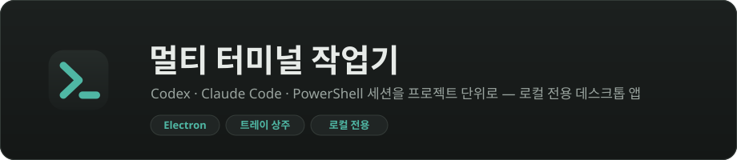
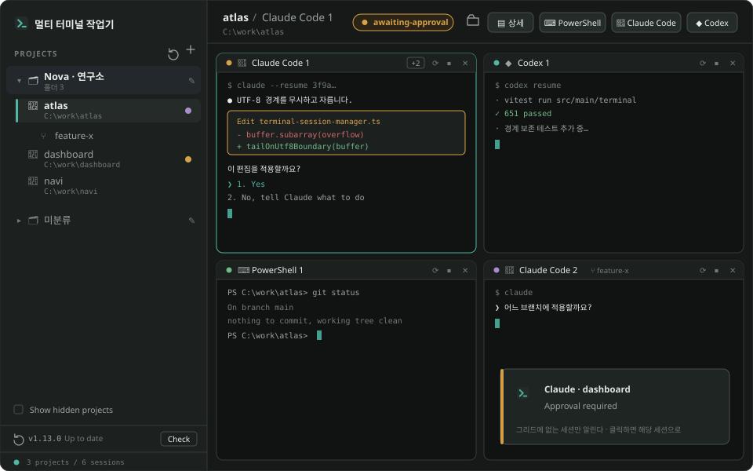
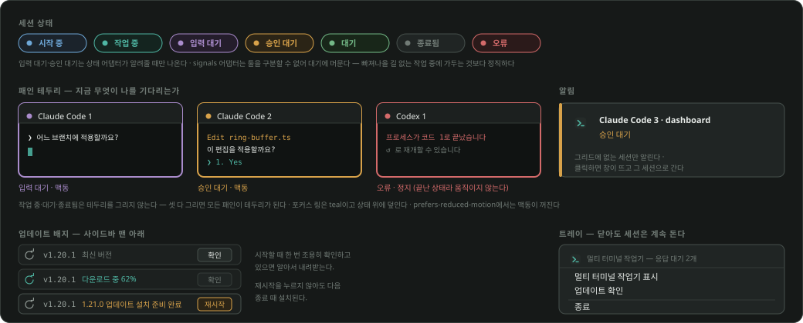
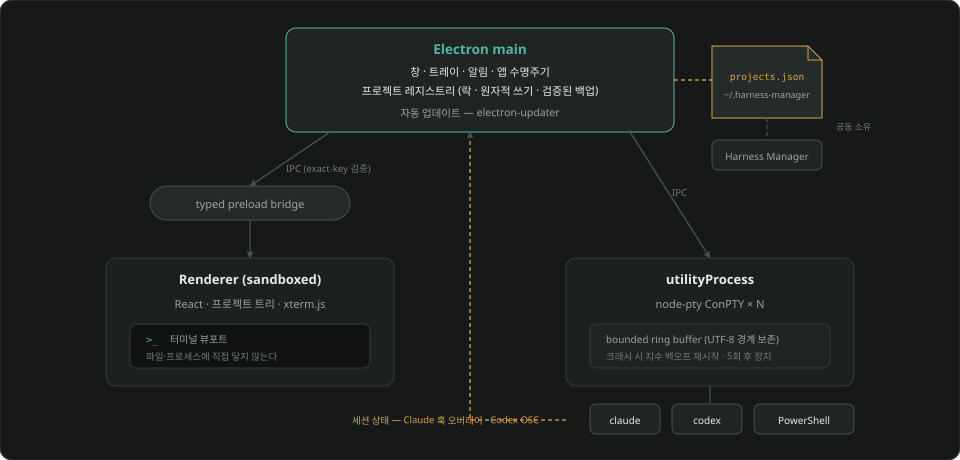

<p align="center">
  
</p>

<p align="center">
  
  
  
  
  
  
</p>

**멀티 터미널 작업기**는 여러 개의 **CLI 에이전트 세션을 작업 폴더 단위로 묶어** 한 창에서 굴리는 **로컬 전용 Windows·Ubuntu 데스크톱 앱**(Electron)이다. **Codex · Claude Code**와 OS 기본 셸(**Windows PowerShell / Linux Bash**)이 들어 있고, 그 밖의 CLI는 `agents.json`에 적어 넣으면 같은 자격으로 붙는다.

- 왼쪽 트리에 **업무 프로젝트 > 열어둔 폴더 > 그 폴더의 세션과 문서**. 폴더를 누르면 그 폴더의 패인이 오른쪽 **슬롯 그리드**를 채운다.
- 앱이 들고 있는 세션·문서는 폴더와 상관없이 **작업공간** 한 화면에 자동으로 모인다. 지금 안 보고 싶은 것은 **숨김**으로 옮긴다.
- 각 세션이 **무슨 상태인지** 패인 테두리와 사이드바 배지에 그려지고, 화면에 없는 세션이 나를 기다리기 시작하면 **데스크톱 알림**이 뜬다.
- 창을 닫아도 **트레이에 상주**하며 세션은 계속 돈다. 재시작하면 폴더·패인·스크롤백이 복원되고 중단된 대화는 처음 열람할 때 이어붙는다.
- 폴더 목록은 이 앱만의 것(`~/.multi-cli-work/projects.json`)이다. 열어둔 폴더만 남고, 저절로 늘어나지 않는다.

터미널·창·스크롤백은 이 앱 안에만 있다. Windows 제어 CLI는 사용자 named pipe, Linux 제어 CLI는 임의의 `127.0.0.1` 포트와 실행별 bearer token을 사용하며 외부 인터페이스에는 바인딩하지 않는다. 외부 통신은 사용자가 실행한 GitHub PR 조회·댓글, `fetch`/`pull`/`push`, GitHub 링크 열기와 앱 업데이트 확인·다운로드에서 발생한다. 인증은 시스템 `git`/`gh` 설정이 맡는다.

## 미리보기

<p align="center"></p>

<p align="center"><em>왼쪽에 작업공간·숨김과 업무 프로젝트·폴더·세션, 오른쪽에 그 폴더의 패인이 세로 열로. 가운데 열만 2행으로 나뉘어 있고, 맨 오른쪽은 문서 패인이다. 화면에 없는 세션이 기다리기 시작하면 알림이 뜬다.</em></p>

<p align="center"></p>

<p align="center"><em>세션 상태 7종과 그것을 그리는 패인 테두리, 업데이트 배지의 상태 전이, 알림·트레이.</em></p>

## 빠른 시작

1. [최신 릴리스](https://github.com/rafaam11/multi-cli-work/releases/latest)에서 Windows 또는 Ubuntu x64 자산을 받는다.
2. Windows는 `Multi-CLI-Work-Setup-x.y.z.exe`를 실행한다. 사용자 단위 설치라 관리자 권한이 필요 없고, 서명되지 않은 빌드는 SmartScreen의 **추가 정보 → 실행**으로 진행한다.
3. Ubuntu 22.04 x64는 DEB를 권장한다: `sudo apt install ./Multi-CLI-Work-*-linux-x64.deb`. AppImage는 `chmod +x` 후 직접 실행하며 FUSE2가 필요 없다.

**Node.js 설치는 필요 없다**(Electron에 런타임이 내장됨). Linux DEB는 상태 훅과 `jk`용 Python 3를 의존성으로 설치한다. PowerShell/Bash는 OS에 맞춰 노출되고, `claude`·`codex`는 로그인 셸 `PATH`에서 자동 인식한다 — 설치되지 않은 CLI는 런처에서 `미설치`로 비활성이다. 자세한 절차는 [`docs/installation.md`](docs/installation.md)를 본다.

**업데이트는 자동이다.** 시작할 때 한 번 조용히 GitHub 릴리스를 조회해 새 버전이 있으면 배경에서 **차등 다운로드**(blockmap delta)하고, 완료되면 사이드바 하단 배지가 **`재시작`** 으로 바뀐다. 누르면 돌고 있는 세션을 먼저 정리한 뒤 무음 설치하고 앱이 다시 뜬다 — 누르지 않아도 다음 종료 때 설치된다. 배지의 **`확인`** 으로 즉시 확인할 수 있고, 자동 확인이 실패하면 같은 자리에 **`릴리스`** 링크가 떠 수동 설치로 대체된다. DEB는 자리에서 교체할 수 없으므로 새 DEB를 받아 다시 설치한다.

> **v1.0.0은 1회 수동 설치**가 필요하다 — 갈아끼울 기존 설치본이 없기 때문. 이후부터는 위 절차로 자동 갱신된다.

## 화면

### 사이드바

맨 위에 **작업공간**과 **숨김** 두 줄, 그 아래에 **업무 프로젝트 > 폴더 > 세션·문서** 세 겹의 트리가 선다.

**작업공간과 숨김.** 작업공간에는 앱이 들고 있는 세션과 문서가 **전부 자동으로** 모인다 — 끌어다 놓을 필요도, 메뉴를 열 필요도 없고, 복원된 세션이나 다른 창이 만든 세션도 같은 자리로 들어온다(원본 폴더의 행은 그대로 남는 참조다). 화면은 그대로 두고 조용히 담기므로, 모아 놓은 화면을 보려면 작업공간 행을 누른다. 잠시 빼 둘 패인은 **✕** 로 숨김에 옮긴다 — 세션은 계속 돌고 문서도 열린 채다. 숨김도 같은 슬롯 그리드라 숨긴 것만 모아 볼 수 있고, 거기서 **✕** 를 누르면 작업공간으로 돌아온다. 선반에서 ✕가 "슬롯 비우기"가 아니라 "반대편으로 이동"인 이유는 단순하다 — 비워 봐야 다음 자동 수집에서 도로 담긴다. 세션 **우클릭 → 작업공간에서 숨기기 / 다시 표시** 도 같은 이동이다. **모든 패인은 두 곳 중 정확히 한 곳에 있다.**

**폴더 트리.** **＋** 로 작업할 폴더를 열면 목록에 남고, 앱을 껐다 켜도 그대로다. 자동 발견은 하지 않는다 — **내가 연 폴더만** 보인다. 폴더 이름 옆 숫자 칩은 그 폴더가 가진 세션 수(worktree 것 포함)이고, 폴더 색은 직접 켜는 것이 아니라 그 폴더의 에이전트를 따라간다: 실제로 도는 세션이 하나라도 있으면 amber, 아니면 green. 세션 행에는 자기 상태 점이, 폴더 행에는 하위 세션 중 가장 급한 상태의 점(입력 대기 violet, 승인 대기 amber)이 **읽지 않음 배지**로 올라온다. 이미 열려 있는 행을 **다시 누르면 접힌다.** 업무 프로젝트에 폴더를 넣으려면 폴더 행을 그 업무 프로젝트 위로 **끌어다 놓고**, 빼려면 업무 프로젝트 상세의 **프로젝트에서 제외**를 쓴다(폴더 목록에는 남는다). 어디에도 안 넣은 폴더는 **미분류**로 묶인다.

**폴더 우클릭 메뉴** — **새 세션**(설치된 에이전트 전부, `agents.json`에 추가한 것 포함) · **파일 탐색기에서 열기** · **VS Code에서 열기** · **GitHub에서 열기** · **Worktree 만들기** · **이름 변경** · **폴더 다시 연결** · **목록에서 제거** 순. 다시 연결은 폴더를 옮긴 뒤 새 경로를 지정하는 것으로, 세션·메모·업무 프로젝트 소속은 그대로 따라온다. 제거는 UI 목록에서만 빼는 것이고 **디스크의 폴더는 건드리지 않는다**. worktree 행에는 [worktree 전용 항목](#git-작업)이 더 붙는다.

**보던 화면을 두고 세션 추가하기** — 우클릭 메뉴로 시작한 세션은 **화면을 바꾸지 않는다**. 패인은 자기 폴더 그리드의 다음 빈 칸을 받고 작업공간에도 담기지만, 페이지·선택·키보드 포커스는 있던 자리에 그대로 있다. 보고 있는 그리드에 빈 칸이 있으면 그 자리에 조용히 나타나고, 사이드바 폴더 행의 짧은 펄스가 세션이 어디에 생겼는지 알려주는 유일한 신호다.

### 슬롯 그리드

배치는 헤더 왼쪽의 **레이아웃 타일**에서 고른다 — **자동**과 **1열~6열**. 터미널이 쏟아내는 정보는 세로로 흐르므로 **모든 배치는 화면 높이를 온전히 쓰는 세로 열**이고, 기본값 자동은 세션 수만큼 열을 세운다. 위아래로 쌓아야 할 일이 생기면 그건 전체가 아니라 그 열 하나의 사정이므로, **패인 헤더의 분할 버튼**으로 그 열만 2행으로 나눈다(다시 누르면 위쪽 패인이 열을 되찾는다). 분할은 열마다 한 번까지다 — 한 번 더 반토막 내면 남는 스크롤백이 볼 가치가 없어진다. 한 페이지는 6열 × 2행 = **최대 12칸**이다.

**레이아웃이 곧 한 화면의 칸 수**다. 세션이 칸 수보다 많으면 레이아웃 타일 옆의 **‹ 1/2 ›** 로 페이지를 넘기거나, 사이드바 행을 눌러 그 세션이 있는 페이지로 바로 간다 — 화면 밖으로 밀린 세션도 계속 돌고 스크롤백도 그대로다. 칸이 남으면 빈 칸이 드롭 자리로 남는다. 고른 배치는 폴더마다, 선반마다 따로 기억된다.

**헤더의 나머지** — 페이지 화살표 옆의 **⟳ 새로고침** 은 화면에 보이는 패인을 **전부** 지금 창 크기에 맞춰 다시 그린다(세션은 건드리지 않는다). 그 옆의 **에이전트 런처**는 폴더 화면에서는 그 폴더에서, **작업공간·숨김에서는 포커스된 패인과 같은 경로에서** 새 세션을 연다 — 선반은 여러 폴더의 패인을 함께 담으므로, 포커스가 곧 "여기"다(버튼 툴팁이 어느 패인인지 말해 준다). 레이아웃이 **자동**이면 **＋ 새 세션** 이 하나 더 붙어 **최근 폴더 목록**을 띄운다. 자동은 빈 칸을 남기지 않으므로 — 빈 칸의 ＋ 가 원래 그 목록으로 가는 길이다 — 이 버튼이 자동에서의 유일한 입구다. 어느 쪽으로 시작하든 화면은 그대로고, 새 패인은 보고 있던 배치의 끝에 붙는다.

**드래그로 옮기기** — 패인 헤더를 다른 칸으로 끌면 **그 자리에 끼워 넣고 원래 있던 패인부터 한 칸씩 뒤로 민다**(자리 교환이 아니다). 사이드바 행을 빈 칸에 끌어다 놓으면 그 칸에 들어간다. 패인을 그리드의 **위 가장자리**로 끌면 전체 화면, **좌·우 가장자리**로 끌면 2열의 그쪽 절반, **네 모서리**로 끌면 2열을 모두 나눈 2×2의 그 사분면이 된다 — Windows 창 스냅과 같은 조작이고, 결과도 레이아웃 타일과 분할 버튼으로 손수 만들 수 있는 배치 그대로다. 끄는 동안에는 대상 영역만 반투명으로 미리 보이고, 실제 배치는 놓는 순간 한 번만 바뀐다.

### 패인

**헤더는 두 줄이다.** 윗줄은 이 패인의 일이 **어디**에 있는지 적는다 — 폴더 → 브랜치(worktree일 때) → 업무 프로젝트를 아이콘과 함께 늘어놓고, 업무 프로젝트의 카테고리 색이 왼쪽 2px 띠로 붙는다. 열이 좁아지면 오른쪽부터 접히고 **폴더 이름이 마지막까지 남는다**. 폴더에 속하지 않는 터미널은 **도구**로 표시된다. 아랫줄이 상태 점 · 에이전트 아이콘 · 세션 이름 · 버튼이다.

**테두리가 지금 무엇이 나를 기다리는지 말한다.** 입력 대기는 violet, 승인 대기는 amber로 천천히 맥동하고, 오류는 red로 멈춰 선다. 작업 중·대기·종료됨은 테두리를 그리지 않는다 — 셋 다 그리면 모든 패인이 테두리가 되어 아무것도 눈에 띄지 않는다. 포커스 링은 teal이고 상태 테두리 위에 덮인다. `prefers-reduced-motion`에서는 맥동이 꺼진다.

**헤더 버튼** — **분할**(열을 2행으로) · **⟲ 재개**(끝난 세션에만) · **⏹ 중지**(프로세스만 끄고 기록은 남긴다) · **🗑 제거** · **✕**. 제거는 세션과 스크롤백을 **확인 없이 즉시 지우고 되돌릴 수 없다** — 그래서 붉게 칠해 두었다. ✕는 폴더 그리드에서 **슬롯 비우기**(세션은 살아 있고 사이드바 행도 남는다), 선반에서는 **반대편으로 이동**이며 버튼의 툴팁이 어느 쪽인지 말해 준다. 이름을 **더블클릭**하거나 헤더 **우클릭 → 이름 변경** 으로 직접 붙인 이름이 우선하고, **제공자 제목 사용** 으로 되돌린다. 새로고침 버튼은 여기 없다 — 창 전체를 다시 그리는 일이라 [워크스페이스 헤더](#슬롯-그리드) 하나로 옮겼고, 한 패인만 다시 그릴 때는 헤더 **우클릭 → 새로고침** 을 쓴다.

**파일 드래그&드롭** — 탐색기에서 파일·이미지를 터미널에 끌어다 놓으면 따옴표 처리된 절대 경로가 입력줄에 붙는다. 스크린샷을 에이전트에게 보여줄 때 경로를 타이핑할 필요가 없다.

### 파일 탐색기와 문서

오른쪽 사이드바의 **탐색기** 탭이 선택한 폴더의 트리를 그린다. 아이콘은 Material Icon Theme 글리프를 **파일명 → 복합 확장자 → 확장자 → 폴더명** 순으로 찾아 붙이고, git 상태를 트리에 직접 칠한다 — 수정 amber, 추가 green, 삭제 red 취소선, 하위에 변경이 있는 폴더는 점, 무시 경로는 흐리게. 우클릭 메뉴에는 **열기 / 펼치기·접기 / 새 파일 · 새 폴더 / 경로 복사 · 상대 경로 복사 · 이름 복사 / 탐색기에서 표시 / VS Code로 열기 / 이름 변경 · 복제 · 삭제**가 있다. 새 이름은 대화상자가 아니라 **트리 안에서 그 자리에 입력**하고, 삭제는 **휴지통**으로 보내며, 이름을 바꾸면 **열려 있던 탭이 따라간다**.

**문서도 패인이다.** 여기서 연 파일·diff·커밋 그래프·PR은 세션과 같은 자격으로 슬롯을 차지한다. 코드를 띄운 채 그 옆에서 에이전트를 굴리는 배치가 그리드 안에서 끝난다. 문서도 세션처럼 **왼쪽 트리에 자기 행을 만들고**(자기가 나온 폴더나 worktree 아래에 붙는다) 행의 **✕** 로 닫는다 — 저장 안 된 파일은 먼저 물어본다. Markdown은 GFM 미리보기 · task checkbox 자동 저장 · 문서 anchor · 안전한 상대 파일 링크를 제공하고, 일반 UTF-8 텍스트와 HTML 소스도 저장(Ctrl+S)과 실패 재시도를 공유한다.

### 홈·상세 페이지

**홈 대시보드**는 좌측 상단 로고를 누르면 현재 선택을 건드리지 않고 열린다. 전체 세션을 상태 급한 순으로 모아보는 모니터, 업무 프로젝트 목록, CLI·앱 업데이트 상태, 최근 활동 폴더로 바로 세션을 여는 빠른 실행, 상태 전이 이력 피드, 버전·릴리스 노트·저장소 바로가기가 한 화면에 있다.

**프로젝트 상세**는 그리드 헤더의 **상세** 버튼으로 연다. 그 폴더의 세션 카드 목록(없으면 세션 시작 버튼), 탐색기·VS Code·GitHub 바로가기, 진입 시 조회되는 git 브랜치·변경 파일 수, 자동 저장되는 메모와 체크리스트를 모은다. **업무 프로젝트 상세**에는 개요와 구성 폴더 목록이 있고, 여기서 폴더를 프로젝트에서 제외한다.

## 세션

**상태 7종** — 시작 중 · 작업 중 · 입력 대기 · 승인 대기 · 대기 · 종료됨 · 오류. Claude는 앱 전용 **훅 오버레이**로, Codex는 **OSC 9 알림**으로, PowerShell/Bash는 프로세스 신호로 판정한다.

**세션 이름 = 하는 일** — Claude는 자기가 붙인 세션 제목을, Codex는 앱 전용 `SessionStart` hook이 알려 준 트랜스크립트의 첫 프롬프트를 세션 이름으로 쓴다. 작업이 바뀌면 이름도 따라 바뀐다.

> [!WARNING]
> **권한 프롬프트 없이 실행한다.** Claude는 `--dangerously-skip-permissions`, Codex는 `--dangerously-bypass-approvals-and-sandbox` 로 항상 실행한다. 승인 대기로 멈추지 않는 대신 **에이전트가 확인 없이 파일을 고치고 명령을 돌린다** — 신뢰하는 저장소에서만 쓸 것.

**알림** — **지금 보고 있는 페이지에 떠 있지 않은** 세션이 입력 대기나 승인 대기에 들어가면 데스크톱 알림 · 창 attention · 제목 · 트레이 툴팁으로 알린다. Windows에서는 작업표시줄 오버레이도 쓴다. 알림을 클릭하면 창이 뜨고 그 세션으로 간다.

**트레이 상주 · 세션 영속성** — 창을 닫으면 트레이로 숨고 PTY는 살아 있다. **종료**는 돌고 있는 세션을 끌 것인지 확인한 뒤에만 종료한다. 재시작하면 폴더·패인·**바운드 스크롤백**이 복원되고, **앱 종료로 중단된 세션은 처음 열람하는 순간 자동으로 재개**된다(`claude --resume` / `codex resume`) — 이전 기록과 새 출력 사이에는 날짜 구분선이 남는다. 열람할 때만 프로세스가 뜨는 **지연 재개**라 세션이 많아도 메모리를 아낀다. 재개되는 프로세스는 **그 패인이 지금 가진 크기 그대로** 뜬다 — 패인은 자기 크기를 재고 나서 붙으므로, 복원된 기록도 새 출력도 읽는 폭 그대로 접힌다(나중에 크기만 바꿔서는 이미 나온 출력의 줄바꿈을 되돌릴 수 없다). 스스로 종료했거나 크래시로 죽어 마지막 상태가 불확실한 세션은 자동 재개하지 않는다(수동 **재개** 버튼은 그대로).

**폴더가 사라졌을 때** — 아이콘이 `📁`에서 `📁✕`로 바뀌고 새 세션·재개가 막힌다. **다시 연결**로 새 경로를 지정하면 풀린다 — 폴더 **우클릭 → 폴더 다시 연결**, 그리드 헤더의 폴더 버튼, 파일 메뉴 어디서든 같은 동작이고, 선택 대화상자는 옛 경로의 상위 폴더에서 열린다.

**CLI 업데이트** — 타이틀바 **도구** 메뉴의 **Claude Code 업데이트** / **Codex 업데이트**. 홈 디렉터리에서 도는 폴더에 속하지 않는 터미널이 열려 `claude update` / `codex update` 출력을 그대로 보여준다. 폴더를 하나도 안 열었어도 쓸 수 있다.

## Git 작업

**worktree 병렬 세션** — 폴더 우클릭 → **Worktree 만들기**로 브랜치를 저장소 옆 전용 폴더(`<repo>-wt/<브랜치>`)에 체크아웃하면 사이드바 폴더 아래에 worktree 행이 붙고, 그 안의 세션은 서로를 밟지 않는다. worktree를 누르면 그 worktree의 세션만 그리드에 뜬다. 목록은 별도 파일(`worktrees.json`)이라 폴더 목록과 독립적이다. **제거는 두 겹으로 막혀 있다** — 커밋 안 된 변경이 있으면 git이 거부한 이유를 그대로 보여주고, "변경을 버리고 강제 제거"를 명시적으로 눌러야만 강제한다.

<details>
<summary><b>worktree 우클릭 메뉴</b> (폴더 메뉴에 없는 항목들)</summary>

| 항목 | 하는 일 |
|---|---|
| 변경 보기 | 커밋 전 변경을 읽기 전용 diff 패인으로 연다 |
| Git에서 동기화 | 원격 상태를 다시 읽어 이 worktree 행을 갱신한다 |
| Fetch --prune | 사라진 원격 브랜치의 추적 참조까지 정리한다 |
| Worktree 잠금 해제 | 잠긴 worktree에만 나타난다 |
| Stale 관리정보 정리 | 디렉터리가 사라진 worktree의 git 관리정보를 지운다 |
| PR #n 리뷰 완료 및 정리 / Worktree 제거 | PR 리뷰용이면 리뷰를 닫고 정리하고, 아니면 worktree를 제거한다 |

**새 세션 · 파일 탐색기에서 열기 · VS Code에서 열기**는 폴더 메뉴와 같되 worktree 디렉터리에서 시작한다.
</details>

**변경 보기** — 커밋 전 변경을 앱 안에서 읽기 전용으로 본다. 추적되지 않는 파일은 별도 섹션이다. 병렬 에이전트가 만든 결과를 비교해 승자를 고르는 용도이며, 스테이징·머지는 하지 않는다.

**Git 탭** — 변경 파일을 명시적으로 골라 commit하고, 현재 브랜치를 `fetch`·`pull`·`push`한다. 앱이 선택하지 않은 staged 파일은 건드리지 않는다.

**PR 리뷰와 비공개 line note** — GitHub PR의 Files 탭에서 줄별 Draft를 모아 현재 review agent PTY에 한 번에 보낸다. note는 로컬 review registry에만 저장되며 GitHub inline comment로 게시하지 않는다. PR head가 바뀌면 이전 note는 읽기 전용이 된다.

**프롬프트 팬아웃** — 프로젝트 상세에서 같은 프롬프트를 여러 세션(worktree 포함)에 동시 전송한다. 대상을 체크박스로 고르고 버튼을 눌러야만 발사되며, 멀티라인은 bracketed paste로 감싸 중간 개행이 조기 실행되지 않는다.

## 에이전트 추가

OS 기본 셸 · Claude Code · Codex는 코드에 박힌 특별한 존재가 아니라 **빌트인 정의**일 뿐이다. `~/.multi-cli-work/agents.json`에 같은 형식으로 적으면 Gemini CLI든 무엇이든 런처에 나란히 선다. 타이틀바의 **도구 → 에이전트 추가**를 누르면 예시가 담긴 파일이 편집기로 열리고(없으면 먼저 만든다), 저장하고 앱으로 돌아오면 목록이 다시 읽힌다.

```jsonc
{
  "schemaVersion": 1,
  "updatedAt": "2026-07-13T00:00:00.000Z",
  "agents": {
    "gemini": {
      "id": "gemini",                  // 맵 키와 같아야 한다. 소문자·숫자·하이픈
      "label": "Gemini CLI",
      "commands": ["gemini"],          // PATH에서 순서대로 찾는다. 없으면 런처에서 비활성
      "args": ["--cwd", "{cwd}"],      // 항상 붙는 인자
      "newSessionArgs": [],            // 새 세션일 때 앞에 붙는다
      "resumeArgs": [],                // 재개일 때 앞에 붙는다
      "conversationId": "none",        // "none" | "app-generated"
      "statusAdapter": "signals",      // "signals" | "osc9"
      "shiftEnter": "enter",           // "enter" | "alt-enter"
      "accentColor": "#4285f4"         // 아이콘 모노그램 색 (선택)
    }
  }
}
```

**상태 어댑터** — `signals`는 프로세스 생사와 터미널 입력만 본다. **작업 중과 입력 대기를 구별하지 못하므로** 그 세션은 `대기`에 머문다("모르겠다"가 정직한 답이라서, 빠져나올 길 없는 `작업 중`에 가두지 않는다). CLI가 OSC 9 알림을 쏜다면 `osc9`를 고른다 — 빌트인 Codex와 같은 정확도를 얻는다(알림을 켜는 플래그는 그 에이전트의 `args`에 직접 넣는다).

<details>
<summary><b>치환 토큰 · 재개 · Shift+Enter · 빌트인 전용 필드</b></summary>

**치환 토큰** — 인자 안에서 쓸 수 있는 것은 `{cwd}` · `{sessionId}` · `{conversationId}` · `{claudeSettings}` · `{codexProfile}` 다섯 개뿐이고, 뒤의 둘은 빌트인 전용이다. 리터럴 중괄호는 `{{` `}}`. 모르는 토큰은 조용히 통과시키지 않고 **거부**한다 — 오타가 명령줄에 그대로 실려 나가지 않도록.

**재개** — `conversationId: "app-generated"`로 두고 `newSessionArgs`에 `{sessionId}`, `resumeArgs`에 `{conversationId}`를 넣으면 앱이 발급한 id로 대화를 이어붙인다. `"none"`이면 재개는 그냥 새로 띄우는 것이다. CLI가 자기 id를 직접 발급하는 `provider-assigned`는 빌트인 전용이다.

**Shift+Enter** — 터미널은 Shift 여부와 상관없이 Enter를 CR로 보내므로, CLI는 Shift+Enter를 별도의 키로 볼 수 없다. `alt-enter`를 고르면 대신 ESC CR(Alt+Enter)을 보내 crossterm 기반 TUI가 줄바꿈으로 받는다 — 빌트인 Codex가 이걸 쓴다. 그 시퀀스를 모르는 CLI는 쓰레기 입력을 받게 되므로 기본값은 `enter`(그냥 제출)다.

**빌트인 전용** — 브랜드 아이콘(`icon`), 트랜스크립트에서 읽는 세션 제목(`titleSource`), Claude 훅 오버레이(`claude-hook` 어댑터), Codex `SessionStart` hook 상관관계(`provider-assigned`)는 빌트인만 가진다. 사용자 정의 에이전트가 이들을 요구하면 로드 시점에 거부하고 이유를 말한다.
</details>

**파일이 깨졌을 때** — 앱은 죽지 않는다. 빌트인만 싣고 경고 배너에 이유가 뜬다. 세션은 자기가 쓰던 에이전트가 목록에서 사라져도 **목록에 남고 스크롤백도 읽힌다** — 다시 시작하는 것만 막힌다.

## 단축키

터미널에 포커스가 있어도 먹는다 — xterm보다 앞서 도는 capture 단계 리스너가 잡는다.

| 키 | 하는 일 |
|---|---|
| `Ctrl+P` | **빠른 열기** — 세션·폴더·명령(새 세션 · 홈 대시보드 · 에이전트 추가 · 업데이트 확인)을 퍼지 검색해 Enter 한 번에 이동 |
| `Ctrl+S` | 지금 보고 있는 문서 저장(Markdown·HTML·텍스트, 잘리지 않은 UTF-8 파일만) |
| `Ctrl+C` / `Ctrl+Shift+C` | 선택 영역 복사. 선택이 없을 때의 `Ctrl+C`는 터미널 인터럽트로 그대로 나간다 |
| `Ctrl+V` | 붙여넣기 |
| `Ctrl+=` / `Ctrl+-` / `Ctrl+0` | 확대 · 축소 · 원래 크기 |
| `F11` / `F12` | 전체 화면 · 개발자 도구 |

`Ctrl+R`은 일부러 비워 두었다 — 잘못 눌러 렌더러를 다시 로드하는 쪽이 메뉴를 한 번 더 여는 것보다 훨씬 나쁘다(타이틀바 **보기 → 다시 로드**에는 있다).

## 구조와 안전장치

<p align="center"></p>

- **main** — 창·트레이·알림·앱 수명주기와 레지스트리를 소유한다.
- **utilityProcess** — 모든 `node-pty` 프로세스와 바운드 출력 링버퍼를 격리해 소유한다. PTY 워커가 죽으면 지수 백오프로 재시작하고, 연속 실패가 이어지면 멈춰서 에러를 표시한다(무한 재시도 없음).
- **renderer** — 샌드박스 상태로 트리와 xterm.js 터미널만 그린다. 파일·프로세스에 직접 닿지 않는다.
- **preload** — 타입이 붙은 유일한 통로. 모든 입력은 main 쪽에서 exact-key 검증을 거친다.

**안전장치**

- **렌더러는 명령을 못 짠다** — 세션을 만들 때 렌더러가 보내는 건 **에이전트 id뿐**이다. 실행파일과 인자는 main이 레지스트리에서 꺼낸다. `agents.json`은 사용자 홈에 있고 임의의 실행파일을 띄우는 게 목적이므로 샌드박스가 아니다 — 검증은 **오작동을 막기 위한 것**(오타·쓸 수 없는 토큰·빌트인 id 충돌)이지 악의를 막기 위한 게 아니다.
- **레지스트리 쓰기** — `~/.multi-cli-work/` 아래 파일은 모두 같은 규약을 따른다: `proper-lockfile` 크로스 프로세스 락 → 스키마 검증 → 임시 파일 + rename(원자적 교체). 백업은 **검증을 통과한 내용만** `.bak`에 남기므로 깨진 파일이 정상 백업을 덮지 않는다. 목록 파일이 깨지면 읽기 전용으로 내려앉고 경고 배너의 **복구** 버튼이 `.bak`으로 되돌린다.
- **렌더러 격리** — `sandbox: true` · `contextIsolation: true` · `nodeIntegration: false`, CSP 적용, 외부 네비게이션·새 창 차단.
- **사용자 설정을 건드리지 않는다** — Claude는 `~/.claude/settings.json` 대신 앱 전용 오버레이를 `--settings`로 세션에만 얹고, Codex는 `~/.codex/multi-cli-work.config.toml` 프로파일 레이어를 앱이 띄운 세션에만 지정한다.
- **터미널 로그** — 링버퍼·로그 모두 상한이 있고, 잘라낼 때 UTF-8 문자 경계를 보존한다.
- 단일 인스턴스 락으로 중복 실행을 막고, 트레이가 앱 수명을 소유한다(명시적 종료만이 정상 종료 경로).
- 경로·정체성은 안정 UUID + 정규화 경로로 맞춘다.

**jk-coding-cli (앱 제어 CLI)** — 앱이 띄운 터미널 안에서만 쓸 수 있는 오케스트레이션 CLI(별칭 `jk`). `list` · `send` · `read` · `wait` · `spawn`을 제공한다. Windows는 named pipe, Linux는 loopback TCP를 쓰고 둘 다 1MiB 한 줄 JSON 제한과 실행별 token 인증을 적용한다. 중지·제거 같은 파괴적 명령은 의도적으로 없다.

**로컬 데이터** — 전부 로컬에 있고 텔레메트리는 없다.

| 위치 | 담기는 것 |
|---|---|
| `~/.multi-cli-work/` | 폴더·업무 프로젝트·worktree·PR 리뷰 목록과 `agents.json` |
| `userData/` | 창·패인 배치, 스크롤백, 브리프, 앱 전용 훅과 상태 파일, `jk` 클라이언트 |
| `~/.codex/multi-cli-work.config.toml` | 앱이 띄운 Codex 세션에만 적용되는 프로파일 레이어 |

파일 단위 목록과 플랫폼별 동작(Linux PATH 탐색, 제어 서버, 상태 훅)은 [`docs/local-data.md`](docs/local-data.md)에 있다.

설계 문서: [`multi-cli-work-design.md`](docs/superpowers/specs/2026-07-11-multi-cli-work-design.md) · 레지스트리 계약: [`registry-contract.md`](docs/superpowers/specs/registry-contract.md)

## 개발

단일 Electron 프로젝트(electron-vite). 모든 명령은 루트에서 실행한다.

```bash
git clone https://github.com/rafaam11/multi-cli-work.git
cd multi-cli-work
npm ci
npm run dev        # electron-vite dev (main/preload/renderer HMR + Electron 창)
```

| 스크립트 | 설명 |
|---|---|
| `npm run dev` | electron-vite 개발 모드 |
| `npm start` | 빌드된 `out/`을 preview로 실행 |
| `npm test` / `npm run test:watch` | vitest 유닛 테스트 |
| `npm run typecheck` | TypeScript 타입 검사(node + web 2패스) |
| `npm run build` | typecheck + 프로덕션 번들(`out/`) |
| `npm run test:e2e` | 빌드 후 Playwright로 **실제 ConPTY/Unix PTY 세션**을 Electron에서 구동 |
| `npm run test:e2e:smoke` | PR용 Windows 핵심 경로 smoke 묶음 |
| `npm run dist` / `dist:win` | Windows NSIS 설치본 빌드 |
| `npm run dist:linux` / `dist:linux:x64` | Linux x64 DEB·AppImage 빌드 |
| `npm run rebuild:native` | `node-pty`를 현재 Electron ABI로 재빌드 |
| `npm run icons:extract` | Material Icon Theme 글리프 생성(결과는 커밋되어 있어 평소엔 실행할 일이 없다) |

**요구사항** — Windows 10 1809 이상 또는 Ubuntu 22.04 x64. 개발에는 Node.js 22.12+가 필요하다. macOS, Ubuntu 20.04 이하, 기타 CPU 아키텍처, headless 환경은 현재 공식 범위가 아니다.

**릴리스** — `v*` 태그를 푸시하면 태그와 `package.json` 버전을 먼저 비교한 뒤 Windows 2022와 Ubuntu 22.04 x64에서 전체 Electron E2E와 패키징을 수행한다. 결과는 한 작업이 모아 동일한 **draft 릴리스**에 올린다. 최신 변경은 [`docs/release/v1.26.1.md`](docs/release/v1.26.1.md)에서 확인한다.

개발·설치·로컬 데이터 세부 문서: [`docs/development.md`](docs/development.md) · [`docs/installation.md`](docs/installation.md) · [`docs/local-data.md`](docs/local-data.md)
</content>
</invoke>
